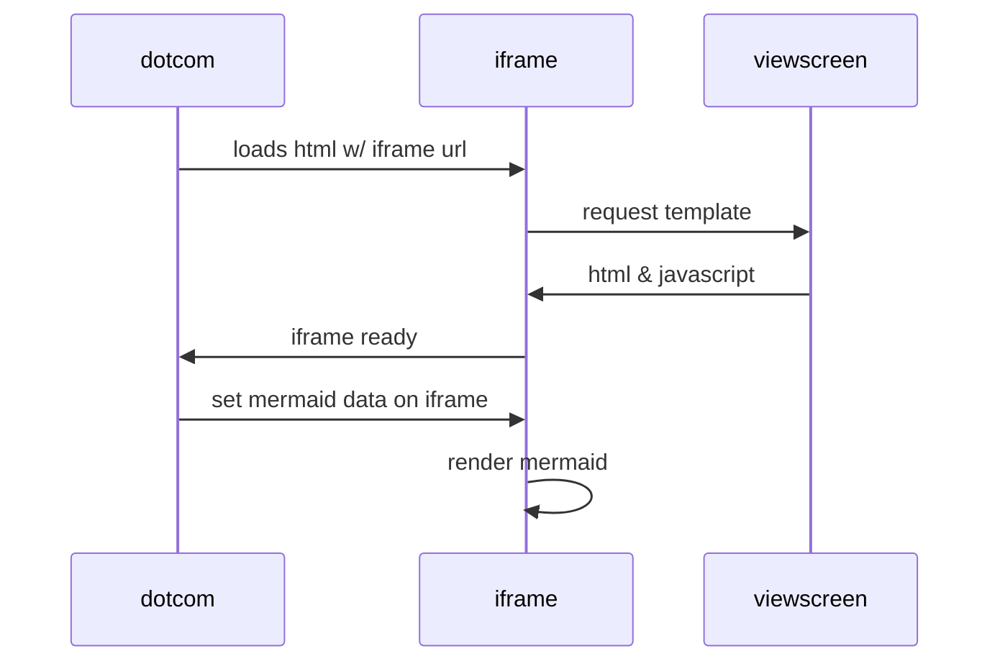

# STEP FOR CONTRIBUTING

## Language

- At all project prefer using English language for code, comments, commit message, and documentation.
- If you are not comfortable with English, you can use Indonesia language for comments documentation and commit message, but code should be in English.
- Use clear and simple language for commit message, comments, and documentation.

## Before contributing

1. Check the issues for the specific project from repository or [huly](https://huly.io)
2. If issue not assigned to anyone, you can assign it to yourself.
3. Before starting work on the issue, please comment on the issue that you are working on it.
4. If you have any question or doubt, you can ask in the issue.
5. If you have any suggestion or improvement, you can create an issue for it and discuss it in issue or discord server.

## Steps for contributing

1. Fork the repository to your account.
2. Clone the repository to your local machine.
3. Create a new branch with the name of the issue you are working on.
4. Make changes to the code.
5. Commit the changes with clear and simple message.
6. Push the changes to your fork, and create a pull request to the main repository.
7. Add the issue number in the pull request description.
8. Wait for the review and approval of the pull request.
9. If there are any changes required, make the changes and push the changes to the same branch.
10. After the approval, the pull request will be merged to the main repository.

